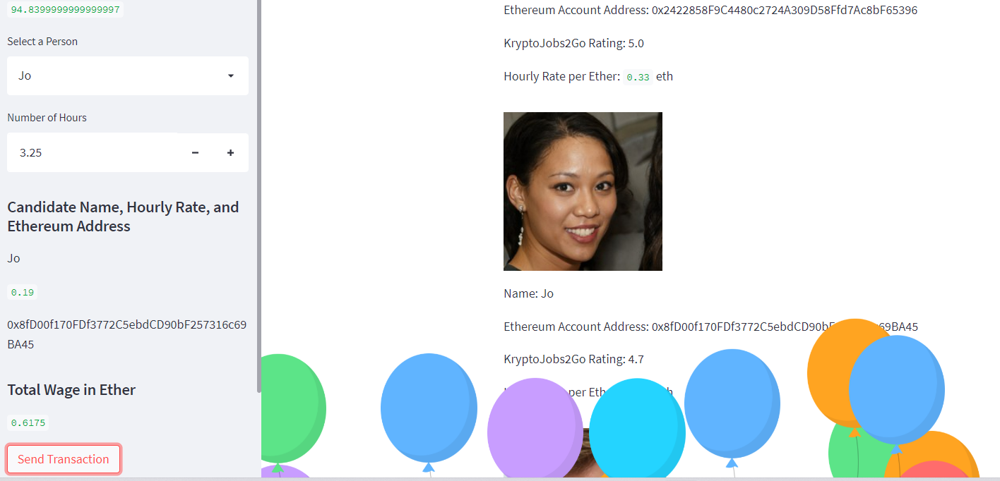
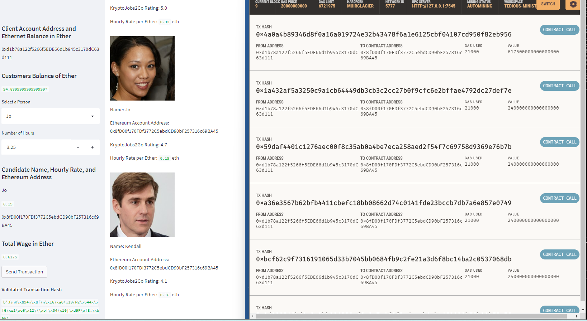
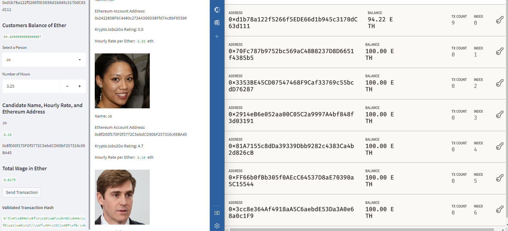
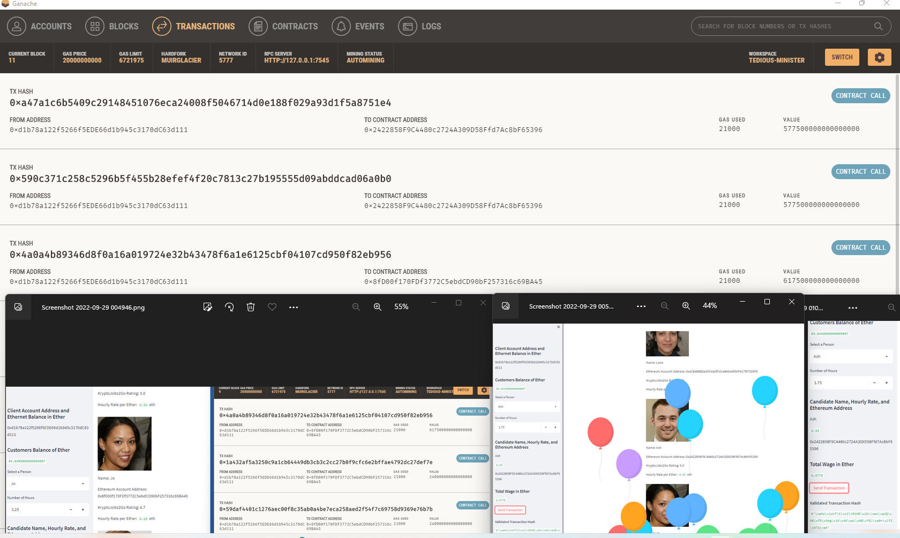

# Krypto_Pay_Wage

 This project is building a platform called KryptoJobs2Go. It is an application that customers can use to choose fintech professionals from a list of candidates, hire them, and pay them in Ethereum. The app integrates the Ethereum blockchain network into its functionality in order to instantly pay the fintech professionals with cryptocurrency.

The KryptoJobs2Go application uses Streamlit for the UI, Ganache for Ethereum transactions, coded in Python.  One code is predominantly functions the other is the product database and UI 

The Application in action.

* Fetch and display the account balance associated with your Ethereum account address.

* Calculate the total value of an Ethereum transaction, including the gas estimate, that pays a KryptoJobs2Go candidate for their work.

* Digitally sign a transaction that pays a KryptoJobs2Go candidate, and send this transaction to the Ganache blockchain.

* Review the transaction hash code associated with the validated blockchain transaction.

To demonstrate how a customer can choose a Fintech professional and pay them as well as demonstrate that the payment was actually made, I have the following images to review.

*  Compare the candidate profiles then select hiree from list on the sidebar, enter time required and click Send Transaction. Note: Balloons float up to indicate transaction success.

* This image shows the UI details including the Transaction hash on one side and the matching transaction details in Ganache on the other when Jo was hired for 3.25hours

* This image shows the Customers account balance in Ganache after transaction 9 which was hiring Jo for .6175eth

* This image shows the next two transactions added to the blockchain, including transaction 11 which was payment for hiring Ash for 1.75 hrs at .5775eth. The Customers Eth balance shows in the sidebar of App at the top and you can see it has decreased compared with the image above.

# To run this Project locally.
Clone repo/
install Streamlit/  
open Ganache to an account/

## Ganache
https://trufflesuite.com/ganache/ 

copy the mnemonic phrase from Ganache account you open into sample env and save as env

set the RPC server address from your Ganache as W3 address in line 20 of crypto_wallet.py

## Streamlit
https://streamlit.io/ 

Pip install Streamlit (streamlit run krypto_jobs.py)

